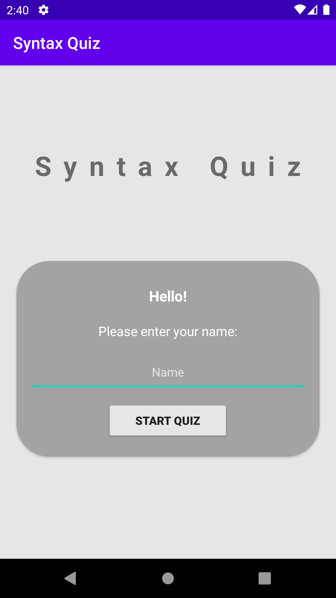
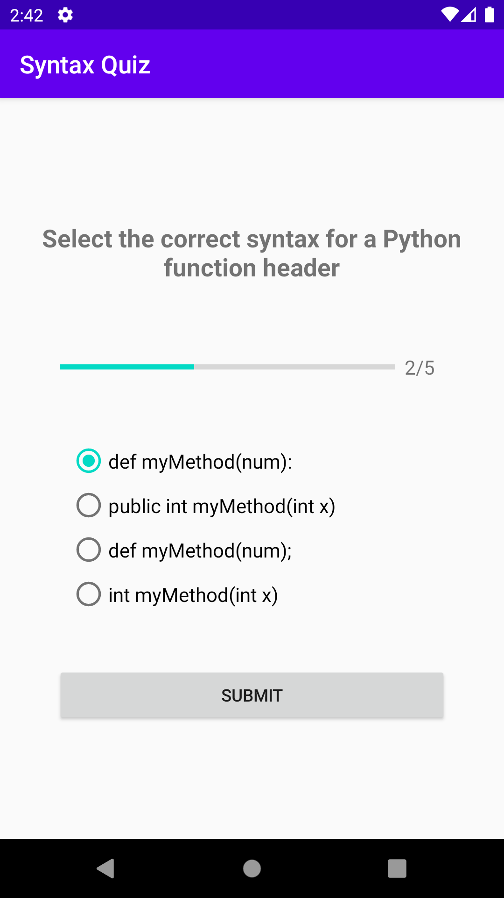
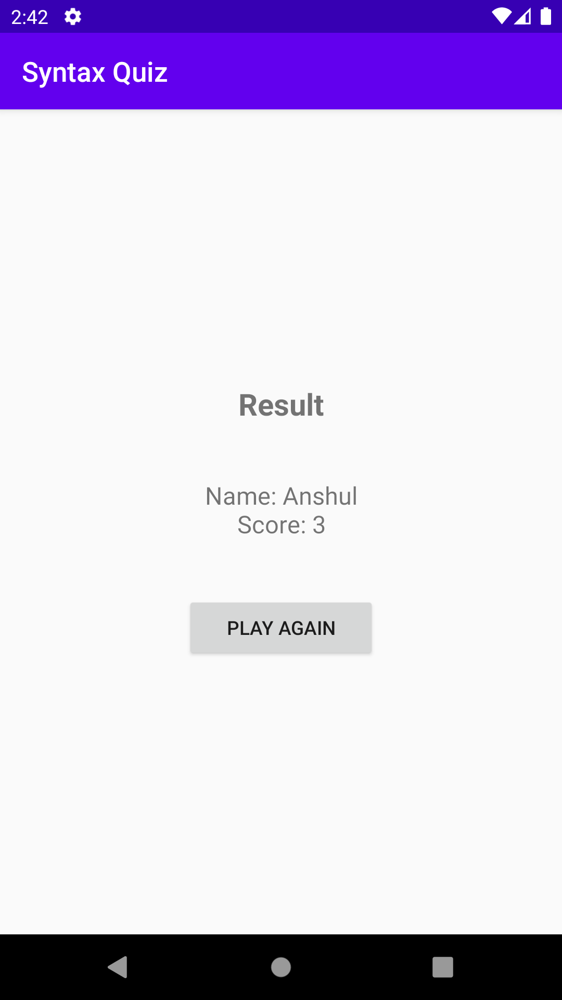

# Syntax Quiz
An android application that quizzes the user on the syntax of common programming languages and displays the score at the end.

Built in Android Studio using Java and XML.

Created in collaboration with [DataStructuresAndAlgorithms](https://github.com/DataStructuresAndAlgorithms).

---

### Start screen:

### Questions screen:

### Result screen:

